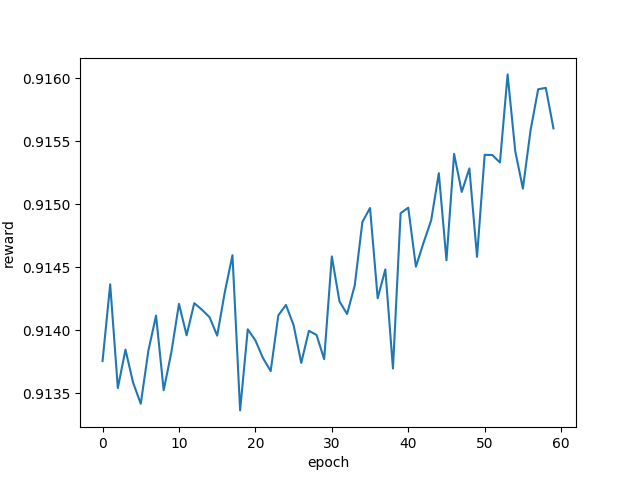

# pytorch-vsumm-reinforce
This repo contains the Pytorch implementation of the AAAI'18 paper - [Deep Reinforcement Learning for Unsupervised Video Summarization with Diversity-Representativeness Reward](https://arxiv.org/abs/1801.00054). The original Theano implementation can be found [here](https://github.com/KaiyangZhou/vsumm-reinforce).

## Get started
1. Download preprocessed datasets
```bash
git clone https://github.com/KaiyangZhou/pytorch-vsumm-reinforce
cd pytorch-vsumm-reinforce
# download datasets.tar.gz (173.5MB)
wget http://www.eecs.qmul.ac.uk/~kz303/vsumm-reinforce/datasets.tar.gz
tar -xvzf datasets.tar.gz
```
2. Make splits
```bash
python create_split.py -d datasets/eccv16_dataset_summe_google_pool5.h5 --save-dir datasets --save-name summe_splits  --num-splits 5
```
As a result, the dataset is randomly split for 5 times, which are saved as json file.

Train and test codes are written in `main.py`. To see the detailed arguments, please do `python main.py -h`.

## How to train
```bash
python main.py -d datasets/eccv16_dataset_summe_google_pool5.h5 -s datasets/summe_splits.json -m summe --gpu 0 --save-dir log/summe-split0 --split-id 0
```

## How to test
```bash
python main.py -d datasets/eccv16_dataset_summe_google_pool5.h5 -s datasets/summe_splits.json -m summe --gpu 0 --save-dir log/summe-split0 --split-id 0 --evaluate --resume path_to_your_model.pth.tar --verbose
```

## Plot
We provide codes to plot the rewards obtained at each epoch. Use `parse_log.py` to plot the average rewards
```bash
python parse_log.py -p path_to/log_train.txt
```
The plotted image would look like
<div align="center">
  
</div>

## Citation
```
@article{zhou2017reinforcevsumm, 
   title={Deep Reinforcement Learning for Unsupervised Video Summarization with Diversity-Representativeness Reward},
   author={Zhou, Kaiyang and Qiao, Yu and Xiang, Tao}, 
   journal={arXiv:1801.00054}, 
   year={2017} 
}
```